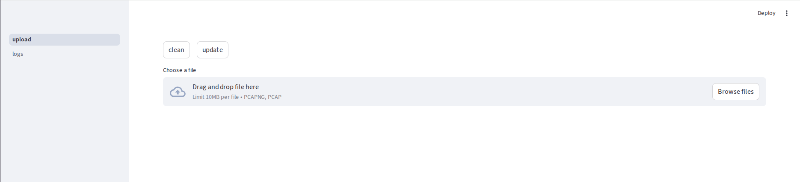
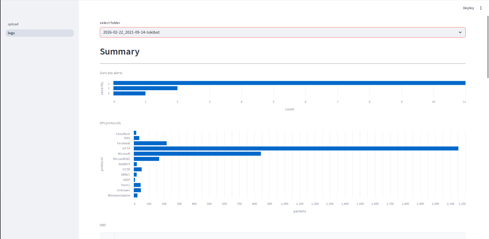
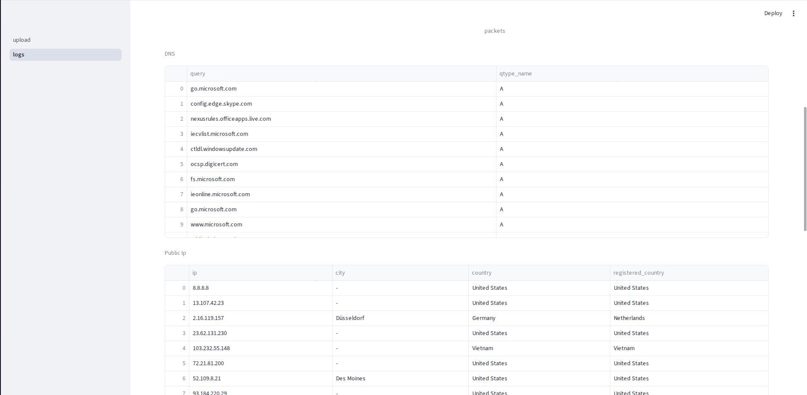
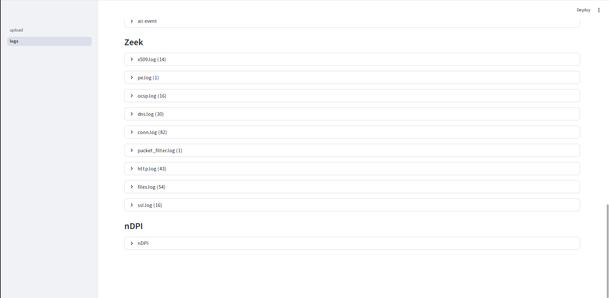

# 🛡 PCAP Analyzer 

### Network dump analysis using: 
- suricata
- zeek
- nDPI

``` 
docker pull jasonish/suricata:7.0.11
docker pull zeek/zeek:8.0 
pip3 install -r requirements.txt
streamlit run upload.py
```





